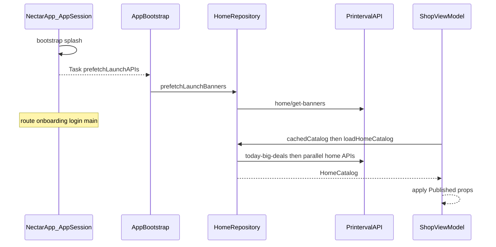

# Luồng xử lý API — Nectar

Tài liệu mô tả cách app gọi Printerval API: từ UI → ViewModel → Repository → API facade → HTTP client → decode → bind UI.

---

## 1. Tổng quan kiến trúc

```
┌─────────────────────────────────────────────────────────────┐
│  UI (SwiftUI)                                               │
│  ShopView / Splash → .task { await viewModel.load… }        │
└────────────────────────────┬────────────────────────────────┘
                             │
┌────────────────────────────▼────────────────────────────────┐
│  ViewModel (@MainActor ObservableObject)                    │
│  ShopViewModel → HomeCatalogProviding                       │
└────────────────────────────┬────────────────────────────────┘
                             │
┌────────────────────────────▼────────────────────────────────┐
│  HomeRepository (Features/Shop/Data)                        │
│  Prefetch + map + cache HomeCatalogStore                    │
│  AppBootstrap.launch → repository.prefetchLaunchBanners()   │
└────────────────────────────┬────────────────────────────────┘
                             │
┌────────────────────────────▼────────────────────────────────┐
│  PrintervalAPI                                              │
│  Mỗi endpoint đang bind UI = 1 hàm                          │
└────────────────────────────┬────────────────────────────────┘
                             │
┌────────────────────────────▼────────────────────────────────┐
│  APIClient (actor)                                          │
│  build URL → headers → URLSession → log → retry → Data      │
└────────────────────────────┬────────────────────────────────┘
                             │
┌────────────────────────────▼────────────────────────────────┐
│  HomeDTOMapper                                              │
│  JSONSerialization / Codable → domain models                │
└─────────────────────────────────────────────────────────────┘
```

| File | Vai trò |
|------|---------|
| `APIConfig.swift` | Service host, endpoint path, timeout, envelope `{ status, result, message }` |
| `AppIdentity.swift` | `token` / `deviceId` / `country` gắn vào query |
| `APIClient.swift` | HTTP client dùng chung (GET/POST, retry, auth header) |
| `PrintervalAPI.swift` | Facade endpoint đang bind UI |
| `AppBootstrap.swift` | Launch → `HomeRepository.prefetchLaunchBanners()` |
| `HomeRepository.swift` | Prefetch/map/cache catalog Shop |
| `NetworkLogger.swift` | Log request/response (DEBUG) |
| `DeviceInfo.swift` | User-Agent |

---

## 2. Timeline khi mở app



**Nguyên tắc:**
- Prefetch **không chặn** chuyển màn (splash vẫn đi tiếp nếu API chậm/timeout).
- 1 API fail **không làm fail cả group** — chỉ bỏ qua, các API khác vẫn chạy.
- Home prefetch **1 lần / session** (`HomeRepository.didLoadHome`).

---

## 3. Hai nhóm prefetch

### 3.1 Launch — `AppBootstrap.prefetchLaunchAPIs()`

Gọi từ `AppSession.bootstrap()` trong `Task` nền.

| API | Service | Endpoint | Bind |
|-----|---------|----------|------|
| Home banners | `variant` | `home/get-banners` | `HomeCatalogStore` → carousel |

> Chi tiết thư mục toàn app: [project-structure.md](./project-structure.md).

### 3.2 Home (Shop) — `HomeRepository.loadHomeCatalog()`

Gọi từ `ShopViewModel.loadHome()` qua protocol `HomeCatalogProviding`.

| API | Service | Endpoint | Bind UI |
|-----|---------|----------|---------|
| Recommendations | `variant` | `recommendation/products` | **Best Selling** |
| Today big deals | `variant` | `today-big-deals` | **Exclusive Offer** |
| Category tree | `variant` | `category/tree` | Category rail |
| Recently viewed | `variant` | `product/recently-viewed` | Recently Viewed |
| Event box | `variant` | `event-box` | EventBox |
| Product videos / Reels | `www` | `product-video/find` | **Reels** (dưới banner) |

Launch: `AppBootstrap.prefetchLaunchAPIs()` → `HomeRepository.prefetchLaunchBanners()` (`home/get-banners`).

> Chi tiết Reels: [`product-reels.md`](./product-reels.md).

---

## 4. Multi-service URL

Mỗi microservice có base URL riêng (`APIService`):

| Service | Host |
|---------|------|
| `customer` | `https://customer-service.printerval.com` |
| `order` | `https://order-service.printerval.com` |
| `variant` | `https://variant-service.printerval.com` |
| `www` | `https://printerval.com` (product-video, …) |

URL cuối = `host` + `path` + query (`token`, `deviceId`, … từ `AppIdentity`).

---

## 5. Luồng 1 request trong `APIClient`

```
1. buildURL(service, path, query)
2. Gắn headers (Accept, Content-Type, user-agent)
3. Nếu authenticated == true → Authorization: Bearer <sessionToken>
4. NetworkLogger.logRequest
5. URLSession.data(for:)
6. NetworkLogger.logResponse (status, body JSON, ms)
7. HTTP 401 → thử refresh token → retry 1 lần
8. Timeout / mất mạng tạm → sleep 0.4s → retry (max 1)
9. Trả Data (getData) hoặc decode T (get / post)
```

Timeout mặc định: request **20s**, resource **45s** (`APIConfig`).

Envelope chuẩn (khi decode):

```json
{
  "status": "successful",
  "result": { ... },
  "message": "..."
}
```

`APIConfig.successStatus == "successful"`.

---

## 6. TaskGroup — lấy data ra UI (ví dụ recommendations)

`HomeRepository.loadHomeCatalog` dùng `withTaskGroup`:

```swift
group.addTask {
    await Self.chunk(APIEndpoint.recommendationProducts) {
        try await PrintervalAPI.fetchRecommendationProducts()
    }
}

for await item in group {
    if case .recommendations(let data) = item {
        let products = HomeDTOMapper.products(from: data)
        store.setRecommendations(products)
    }
}
```

ViewModel:

```swift
let loaded = await catalog.loadHomeCatalog()
apply(loaded) // bestSelling = loaded.recommendations
```

View:

```swift
ProductHorizontalRail(title: "Best Selling", products: viewModel.bestSelling, …)
.task { await viewModel.loadHome() }
```

> View **không** gọi API. Chỉ bind `@Published`.

---

## 7. Cách thêm 1 API mới (checklist)

1. **Endpoint** — path trong `APIEndpoint` (`APIConfig.swift`).
2. **Facade** — hàm trong `PrintervalAPI` → `APIClient.shared.getData`.
3. **Repository** — fetch trong `HomeRepository.loadHomeCatalog` (hoặc launch banners).
4. **Mapper** — `HomeDTOMapper` → domain model.
5. **Store / HomeCatalog** — field + setter nếu cần cache.
6. **ViewModel** — `@Published` + `apply(_:)`.
7. **View** — đọc `@Published`, không gọi API từ View.

---

## 8. Log / debug

- Mọi request/response: `NetworkLogger` → `NectarLog` (OSLog + filter `Nectar log Network`).
- Repository decode: `NectarLog.log(..., title: "Home")`.
- Proxyman / breakpoints / Console.app: xem **[debugging-oslog-proxyman.md](./debugging-oslog-proxyman.md)**.
- Tắt hot-reload khi debug crash: Launch Argument `-DISABLE_HOT_RELOAD` (xem `docs/hot-reload.md`).

---

## 9. Identity hiện tại

`AppIdentity`:

- `deviceId` và `token` **cùng một UUID** (guest).
- `country = "us"`.

Sau auth thật: cập nhật token từ session Keychain thay vì hardcode.

---

## 10. File liên quan nhanh

```
Nectar/Core/Network/
  APIConfig.swift        # hosts, endpoints, envelope
  AppIdentity.swift      # token / deviceId
  APIClient.swift        # HTTP
  PrintervalAPI.swift    # endpoint methods (bind UI)
  AppBootstrap.swift     # launch → HomeRepository.prefetchLaunchBanners
  NetworkLogger.swift
  DeviceInfo.swift

Nectar/Features/Shop/
  Domain/                # models + HomeCatalogProviding
  Data/                  # Mapper, Store, HomeRepository
  Presentation/          # ShopView + ShopViewModel + Components

Nectar/App/AppSession.swift   # gọi launch prefetch
```
