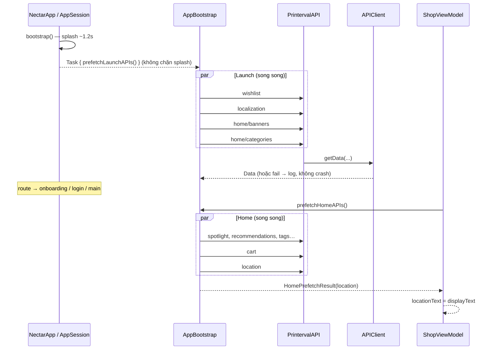

# Luồng xử lý API — Nectar

Tài liệu mô tả cách app gọi Printerval API: từ UI → ViewModel → Bootstrap → API facade → HTTP client → decode → bind UI.

---

## 1. Tổng quan kiến trúc

```
┌─────────────────────────────────────────────────────────────┐
│  UI (SwiftUI)                                               │
│  ShopView / Splash → .task { await viewModel.load… }        │
└────────────────────────────┬────────────────────────────────┘
                             │
┌────────────────────────────▼────────────────────────────────┐
│  ViewModel (@MainActor ObservableObject)                    │
│  ShopViewModel.loadHome() → gán @Published → UI cập nhật    │
└────────────────────────────┬────────────────────────────────┘
                             │
┌────────────────────────────▼────────────────────────────────┐
│  AppBootstrap                                               │
│  Prefetch song song (TaskGroup) — launch / home             │
└────────────────────────────┬────────────────────────────────┘
                             │
┌────────────────────────────▼────────────────────────────────┐
│  PrintervalAPI                                              │
│  Mỗi endpoint = 1 hàm (path, service, query)                │
└────────────────────────────┬────────────────────────────────┘
                             │
┌────────────────────────────▼────────────────────────────────┐
│  APIClient (actor)                                          │
│  build URL → headers → URLSession → log → retry → Data      │
└────────────────────────────┬────────────────────────────────┘
                             │
┌────────────────────────────▼────────────────────────────────┐
│  Decode (DTO)                                               │
│  LocationResult.decode / JSONDecoder / APIEnvelope          │
└─────────────────────────────────────────────────────────────┘
```

| File | Vai trò |
|------|---------|
| `APIConfig.swift` | Service host, endpoint path, timeout, envelope `{ status, result, message }` |
| `AppIdentity.swift` | `token` / `deviceId` / `country` gắn vào query |
| `APIClient.swift` | HTTP client dùng chung (GET/POST, retry, auth header) |
| `PrintervalAPI.swift` | Facade từng API Printerval |
| `AppBootstrap.swift` | Gọi nhiều API song song lúc mở app / vào Shop |
| `NetworkLogger.swift` | Log request/response (DEBUG) |
| `LocationResult.swift` | DTO ví dụ: decode `/location` → text UI |
| `DeviceInfo.swift` | User-Agent |

---

## 2. Timeline khi mở app



**Nguyên tắc:**
- Prefetch **không chặn** chuyển màn (splash vẫn đi tiếp nếu API chậm/timeout).
- 1 API fail **không làm fail cả group** — chỉ log, các API khác vẫn chạy.
- Home prefetch **1 lần / session** (`ShopViewModel.didPrefetchHome`).

---

## 3. Hai nhóm prefetch

### 3.1 Launch — `AppBootstrap.prefetchLaunchAPIs()`

Gọi từ `AppSession.bootstrap()` trong `Task` nền. **Chỉ prefetch endpoint đang bind UI.**

| API | Service | Endpoint | Bind |
|-----|---------|----------|------|
| Localization | `variant` | `localization` | `LocalizationStore` |
| Home banners | `variant` | `home/get-banners` | `HomeCatalogStore` → carousel |

**Localization** decode theo envelope:

```json
{ "status": "successful", "result": { "default_locale", "default_currency_unit", "locales[]", "currency_units[]", "hreflangs" } }
```

→ `LocalizationPayload` → `LocalizationStore.shared` → Shop header (`list_text`, vd. `"US and Others"`).

> Chi tiết thư mục toàn app: [project-structure.md](./project-structure.md).

### 3.2 Home (Shop) — `AppBootstrap.prefetchHomeAPIs()`

Gọi từ `ShopViewModel.loadHome()`.

| API | Service | Endpoint | Bind UI |
|-----|---------|----------|---------|
| Recommendations | `variant` | `recommendation/products` | **Best Selling** |
| Today big deals | `variant` | `today-big-deals` | **Exclusive Offer** |
| Location | `variant` | `location` | Header geo (nếu decode được) |

> Endpoint khác vẫn khai báo trong `PrintervalAPI` / `APIEndpoint` để dùng sau — không gọi prefetch cho đến khi có UI.

---

## 4. Multi-service URL

Mỗi microservice có base URL riêng (`APIService`):

| Service | Host |
|---------|------|
| `customer` | `https://customer-service.printerval.com` |
| `order` | `https://order-service.printerval.com` |
| `variant` | `https://variant-service.printerval.com` |
| `suggestion` | `https://suggestion.printerval.com` |

URL cuối = `host` + `path` + query (`token`, `deviceId`, … từ `AppIdentity`).

---

## 5. Luồng 1 request trong `APIClient`

```
1. buildURL(service, path, query)
2. Gắn headers (Accept, Content-Type, user-agent)
3. Nếu authenticated == true → Authorization: Bearer <sessionToken>
4. NetworkLogger.logRequest
5. URLSession.data(for:)
6. NetworkLogger.logResponse (status, body JSON, ms)
7. HTTP 401 → thử refresh token → retry 1 lần
8. Timeout / mất mạng tạm → sleep 0.4s → retry (max 1)
9. Trả Data (getData) hoặc decode T (get / post)
```

Timeout mặc định: request **20s**, resource **45s** (`APIConfig`).

Envelope chuẩn (khi decode):

```json
{
  "status": "successful",
  "result": { ... },
  "message": "..."
}
```

`APIConfig.successStatus == "successful"`.

---

## 6. TaskGroup — lấy data ra UI (ví dụ location)

`prefetchHomeAPIs` dùng `withTaskGroup` trả về `HomeChunk`:

```swift
group.addTask { await chunk("location") { try await PrintervalAPI.fetchLocation() } }

for await item in group {
    if case .location(let data) = item {
        result.location = try LocationResult.decode(from: data)
    }
}
```

ViewModel:

```swift
let result = await AppBootstrap.prefetchHomeAPIs()
locationText = result.location?.displayText ?? "Hanoi, Vietnam"
```

View:

```swift
Text(viewModel.locationText)
.task { await viewModel.loadHome() }
```

> **Lưu ý:** Không `print` ở cấp `struct View` (ngoài `body`). Log trong `.task` / ViewModel.

---

## 7. Cách thêm 1 API mới (checklist)

1. **Endpoint** — thêm path trong `APIEndpoint` (`APIConfig.swift`).
2. **Facade** — thêm hàm trong `PrintervalAPI` gọi `APIClient.shared.getData` / `get`.
3. **Bootstrap** (nếu prefetch) — `group.addTask` trong `prefetchLaunchAPIs` hoặc `prefetchHomeAPIs`.
4. **DTO** — `struct …: Decodable` (+ decode từ `APIEnvelope` nếu cần).
5. **Chunk / result** — nếu cần bind UI: thêm case trong `HomeChunk` / field trong `HomePrefetchResult`.
6. **ViewModel** — `@Published` + gán sau prefetch.
7. **View** — đọc `@Published`, không gọi API trực tiếp từ View.

---

## 8. Log / debug

- Mọi request/response: `NetworkLogger` (Xcode Console, DEBUG).
- Bootstrap fail: `⚠️ Bootstrap[name] failed: …`
- Location decode: `📍 location decoded: …`
- ViewModel: `🛒 viewModel after load: …`

Tắt hot-reload khi debug crash mạng: Launch Argument `-DISABLE_HOT_RELOAD` (xem `docs/hot-reload.md`).

---

## 9. Identity hiện tại

`AppIdentity`:

- `deviceId` và `token` **cùng một UUID** (guest).
- `country = "us"`.

Sau auth thật: cập nhật token từ session Keychain thay vì hardcode.

---

## 10. File liên quan nhanh

```
Nectar/Core/Network/
  APIConfig.swift        # hosts, endpoints, envelope
  AppIdentity.swift      # token / deviceId
  APIClient.swift        # HTTP
  PrintervalAPI.swift    # endpoint methods
  AppBootstrap.swift     # parallel prefetch
  NetworkLogger.swift    # console logs
  LocationResult.swift   # DTO location
  DeviceInfo.swift       # User-Agent

Nectar/App/AppSession.swift                      # gọi launch prefetch
Nectar/Features/Shop/Presentation/ShopViewModel.swift  # gọi home prefetch
Nectar/Features/Shop/Presentation/ShopView.swift       # bind UI
```
