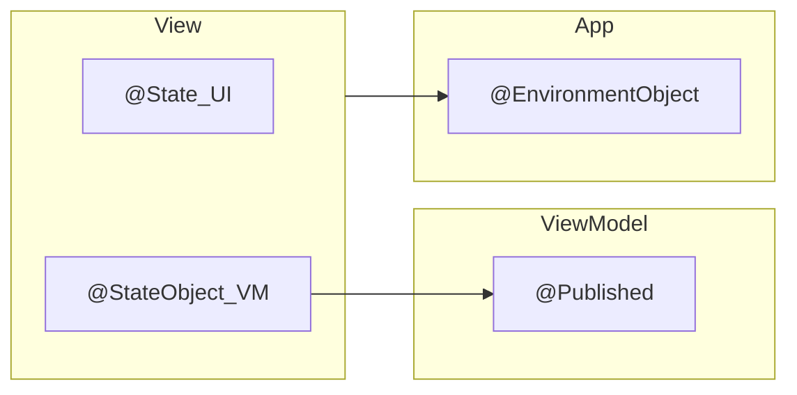
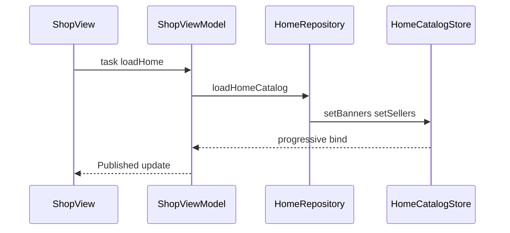

# React Native → SwiftUI Mental Model

Cheat-sheet cho **senior React Native**: so sánh **code RN ↔ SwiftUI** theo pattern **Nectar grocery**.

Guide UI/layout dài: [swiftui-for-react-native.md](./swiftui-for-react-native.md).

---

## Mục lục

1. [Map 1-1 nhanh](#1-map-1-1-nhanh)
2. [Props](#2-props)
3. [Local state vs ViewModel](#3-local-state-vs-viewmodel)
4. [Global state và Context](#4-global-state-và-context)
5. [Server state (React Query)](#5-server-state-react-query)
6. [Hooks → lifecycle SwiftUI](#6-hooks--lifecycle-swiftui)
7. [Re-render mental model](#7-re-render-mental-model)
8. [Cheat: cần làm gì thì dùng gì](#8-cheat-cần-làm-gì-thì-dùng-gì)
9. [Observation iOS 17+](#9-observation-ios-17)
10. [Liên kết](#10-liên-kết)

---

## 1. Map 1-1 nhanh

| React Native | SwiftUI (Nectar) | Đúng nghĩa |
|--------------|------------------|------------|
| props | `let` / `var` trên `View` | Input từ parent |
| controlled input | `Binding` qua `$` | `$viewModel.field` hoặc `$state` |
| `useState` | `@State` | State **local UI** của 1 View |
| screen store / custom hook trả state | `@StateObject` + `ObservableObject` ViewModel | Screen **sở hữu** instance |
| truyền store từ cha xuống | `@ObservedObject` | Parent giữ VM, con quan sát |
| Context Provider | `.environmentObject(...)` | Inject ở root |
| `useContext` / Zustand hook | `@EnvironmentObject` | Đọc object đã inject |
| React Query cache + fetch | Repository + `HomeCatalogStore` + ViewModel `@Published` | Không có `useQuery` sẵn |
| `useEffect` mount | `.task { }` | Async + tự cancel |
| `useEffect([deps])` | `.task(id:)` / `.onChange(of:)` | Chạy lại khi deps đổi |
| `useMemo` | computed `var` | Tính lại khi dependency đổi |
| `useCallback` | method trên ViewModel | Không cần ổn định identity như JS |

---

## 2. Props

### 2.1. Truyền props xuống child

**React Native**

```tsx
type Props = {
  title?: string;
  products: Product[];
  currencySymbol?: string;
  onAdd?: (p: Product) => void;
};

function ProductRail({ title, products, currencySymbol = "$", onAdd }: Props) {
  return (
    <View>
      {title ? <Text>{title}</Text> : null}
      {products.map((p) => (
        <ProductCard key={p.id} product={p} onAdd={() => onAdd?.(p)} />
      ))}
    </View>
  );
}

// Parent:
<ProductRail title="Best Selling" products={items} onAdd={handleAdd} />
```

**SwiftUI (Nectar)**

```swift
struct ProductHorizontalRail: View {
    let title: String?                       // ≈ props readonly
    let products: [ShopProduct]
    var currencySymbol: String = "$"         // ≈ defaultProps
    var onAdd: ((ShopProduct) -> Void)?    // ≈ optional callback

    var body: some View {
        VStack(alignment: .leading) {
            if let title, !title.isEmpty {
                HomeSectionHeader(title: title, onSeeAll: nil)
            }
            // ForEach ≈ map + key={id}
            ForEach(products) { product in
                ProductCardView(product: product, onAdd: { onAdd?(product) })
            }
        }
    }
}

// Parent:
ProductHorizontalRail(
    title: "Best Selling",
    products: viewModel.bestSelling,
    onAdd: { _ in }
)
```

File: `Nectar/Features/Shop/Presentation/Components/ProductHorizontalRail.swift`

| RN | SwiftUI | Lưu ý |
|----|---------|--------|
| `props.title` | `let title` | `let` = không đổi từ bên trong child |
| `products.map` | `ForEach(products)` | Model cần `Identifiable` (`id`) |
| `onAdd?.()` | `onAdd?(product)` | Closure optional giống RN |
| spread `{...rest}` | không có | Phải truyền tường minh |

**Khác biệt quan trọng:** `View` là **`struct` (value type)**. Mỗi lần parent cập nhật, SwiftUI tạo lại value mới rồi diff `body` — không phải cùng một instance class như class component RN.

---

### 2.2. Controlled input (value + onChange)

**React Native**

```tsx
const [username, setUsername] = useState("test1@gmail.com");

<TextInput
  value={username}
  onChangeText={setUsername}
  autoCapitalize="none"
/>
```

**SwiftUI — state nằm ViewModel (Nectar Login)**

```swift
// LoginViewModel
@Published var username = "test1@gmail.com"

// LoginView
TextField("Username", text: $viewModel.username)
    .textInputAutocapitalization(.never)
```

| RN | SwiftUI |
|----|---------|
| `value={username}` | `text: $viewModel.username` |
| `onChangeText={setUsername}` | Binding `$` lo cả đọc lẫn ghi |
| `useState` trên screen | thường `@Published` trên ViewModel (form + submit chung chỗ) |

`$` = **Binding**. Có thể bind vào:

- `@State` local: `TextField(..., text: $searchText)`
- `@Published` trên `ObservableObject`: `TextField(..., text: $viewModel.username)`

File: `Nectar/Features/Auth/Presentation/LoginView.swift`, `LoginViewModel.swift`

---

## 3. Local state vs ViewModel



### 3.1. `useState` ↔ `@State` (chỉ UI local)

**React Native**

```tsx
const [searchText, setSearchText] = useState("");
const [focused, setFocused] = useState(false);

<TextInput value={searchText} onChangeText={setSearchText} />
```

**SwiftUI**

```swift
@State private var searchText = ""
@FocusState private var searchFieldIsFocused: Bool

TextField("Search", text: $searchText)
    .focused($searchFieldIsFocused)
```

Dùng `@State` cho: focus, sheet/dialog local, toggle UI nhẹ.  
**Không** nhét list API / token vào `@State`.

---

### 3.2. Screen store / custom hook ↔ `@StateObject` + ViewModel

**React Native (Zustand slice hoặc custom hook)**

```tsx
function useShopHome() {
  const [banners, setBanners] = useState<Banner[]>([]);
  const [isLoading, setLoading] = useState(false);

  const loadHome = useCallback(async () => {
    setLoading(true);
    try {
      const data = await homeApi.fetchCatalog();
      setBanners(data.banners);
    } finally {
      setLoading(false);
    }
  }, []);

  return { banners, isLoading, loadHome };
}

function ShopScreen() {
  const { banners, isLoading, loadHome } = useShopHome();
  useEffect(() => { void loadHome(); }, [loadHome]);
  // ...
}
```

**SwiftUI (Nectar)**

```swift
@MainActor
final class ShopViewModel: ObservableObject {
    @Published private(set) var banners: [HomeBanner] = []
    @Published private(set) var isLoadingHome = false

    func loadHome() async {
        isLoadingHome = true
        defer { isLoadingHome = false }
        _ = await catalog.loadHomeCatalog()
    }
}

struct ShopView: View {
    @StateObject private var viewModel = ShopViewModel()  // sở hữu 1 lần

    var body: some View {
        ScrollView { /* đọc viewModel.banners */ }
            .task { await viewModel.loadHome() }
    }
}
```

| RN | SwiftUI | Sai thường gặp |
|----|---------|----------------|
| `useShopHome()` tạo state ổn định trong hook | `@StateObject private var viewModel = ShopViewModel()` | Dùng `@ObservedObject var viewModel = ShopViewModel()` → **có thể tạo mới mỗi render** |
| `setBanners(...)` | `banners = ...` trong ViewModel | Gán `@Published` từ background thread → cần `@MainActor` |
| trả `{ state, actions }` từ hook | View đọc `viewModel.*`, gọi `viewModel.loadHome()` | Nhét business vào `body` View |

---

### 3.3. `@StateObject` vs `@ObservedObject`

| Tình huống | Wrapper | Tương đương RN |
|------------|---------|----------------|
| Screen **tạo** `ShopViewModel()` | `@StateObject` | Hook/store sống trong screen |
| Child **nhận** VM từ parent | `@ObservedObject` | `<Child store={store} />` |

```swift
// ĐÚNG — parent sở hữu
struct ShopView: View {
    @StateObject private var viewModel = ShopViewModel()
    var body: some View {
        ChildRail(viewModel: viewModel)
    }
}

struct ChildRail: View {
    @ObservedObject var viewModel: ShopViewModel  // chỉ quan sát
    // ...
}

// SAI
struct ShopView: View {
    @ObservedObject var viewModel = ShopViewModel() // nguy hiểm
}
```

---

### 3.4. `@Published` ≈ field trong store

```swift
@Published private(set) var banners: [HomeBanner] = []  // View chỉ đọc
@Published var username = "test1@gmail.com"             // form 2-way bind
```

`private(set)` ≈ chỉ store được `set`, UI không gán trực tiếp (trừ Binding form bạn chủ ý mở).

---

## 4. Global state và Context

### 4.1. Provider + Consumer

**React Native (Context)**

```tsx
const AuthContext = createContext<AuthSession | null>(null);

function App() {
  const [session, setSession] = useState<AuthSession | null>(null);
  return (
    <AuthContext.Provider value={{ session, setSession }}>
      <RootNavigator />
    </AuthContext.Provider>
  );
}

function ProfileScreen() {
  const { session } = useContext(AuthContext)!;
  return <Text>{session?.displayName}</Text>;
}
```

**React Native (Zustand — gần Nectar hơn)**

```tsx
const useAuthStore = create((set) => ({
  token: null as string | null,
  loginSucceeded: (token: string) => set({ token }),
  logout: () => set({ token: null }),
}));

function ProfileScreen() {
  const token = useAuthStore((s) => s.token);
}
```

**SwiftUI (Nectar)**

```swift
// Provider — NectarApp.swift
@main
struct NectarApp: App {
    @StateObject private var session = AppSession()
    @StateObject private var router = AppRouter()

    var body: some Scene {
        WindowGroup {
            RootView()
                .environmentObject(session)  // ≈ Provider
                .environmentObject(router)
        }
    }
}

// Consumer — bất kỳ View con
struct LoginView: View {
    @EnvironmentObject private var session: AppSession

    private func submitLogin() async {
        if let auth = await viewModel.login() {
            session.loginSucceeded(session: auth)  // ≈ store.loginSucceeded
        }
    }
}
```

| RN | SwiftUI | Nectar |
|----|---------|--------|
| `<Provider value={...}>` | `.environmentObject(session)` | `NectarApp` |
| `useContext(AuthContext)` | `@EnvironmentObject var session` | Login / Profile / Root |
| Zustand `useAuthStore()` | cùng `@EnvironmentObject` | `AppSession` |
| MMKV persist token | Keychain | `AppStorageService` + `KeychainService` |
| Auth gate | `switch session.route` | `RootView` |

### 4.2. `@EnvironmentObject` ≠ `@Environment`

| API | Giống RN | Dùng cho |
|-----|----------|----------|
| `@EnvironmentObject` | Context / Zustand object | `AppSession`, `AppRouter` (bạn tạo) |
| `@Environment(\.dismiss)` | navigation helper | Đóng sheet / pop — **không** phải global store |

```swift
@Environment(\.dismiss) private var dismiss
// ≈ navigation.goBack() / navigation.pop()
```

---

## 5. Server state (React Query)

Nectar **không** có TanStack Query. Map tư duy như sau:

| React Query | Nectar | Khác biệt |
|-------------|--------|-----------|
| `queryKey` + `queryFn` | `loadHome()` → `HomeRepository` | Key ngầm trong method / store |
| cache | `HomeCatalogStore` + `didLoadHome` | Cache thủ công, không staleTime sẵn |
| `isLoading` | `isLoadingHome` | Thường gộp luôn “fetching” |
| `isFetching` (background) | progressive bind từ store | Store cập nhật từng chunk → VM bind |
| `data` | `@Published banners / products / ...` | Nhiều field thay 1 `data` |
| `invalidate` / refetch | gọi lại `loadHomeCatalog()` | Không có `queryClient` |
| `useMutation` | `AuthRepository.login` | Rồi ghi `AppSession` |

### 5.1. `useQuery` ↔ load Home

**React Native**

```tsx
const { data, isLoading, refetch } = useQuery({
  queryKey: ["homeCatalog"],
  queryFn: () => homeApi.fetchCatalog(),
});

useEffect(() => {
  // hoặc chỉ dựa vào useQuery tự fetch
}, []);
```

**SwiftUI (Nectar)**

```swift
// ShopView
.task { await viewModel.loadHome() }

// ShopViewModel
func loadHome() async {
    guard !didRequestHomeLoad else { return }
    didRequestHomeLoad = true
    isLoadingHome = true
    defer { isLoadingHome = false }
    _ = await catalog.loadHomeCatalog()
}
```



Files: `ShopView.swift`, `ShopViewModel.swift`, `HomeRepository.swift`, `HomeCatalogStore.swift`

### 5.2. Placeholder loading (skeleton)

**React Native**

```tsx
{isLoading && !banners?.length ? <BannerSkeleton /> : <BannerCarousel data={banners} />}
```

**SwiftUI (Nectar)**

```swift
var showBannersSkeleton: Bool { isLoadingHome && banners.isEmpty }

HomeBannerCarousel(banners: viewModel.banners)
    .skeleton(isLoading: viewModel.showBannersSkeleton) {
        SkeletonLayout.banner()
    }
```

Điều kiện `isLoading && isEmpty` ≈ không che data đã cache (giống `isLoading` lần đầu, không phải mọi `isFetching`).

### 5.3. `useMutation` ↔ Login

**React Native**

```tsx
const loginMutation = useMutation({
  mutationFn: (body) => api.login(body),
  onSuccess: (session) => {
    useAuthStore.getState().setSession(session);
    navigation.replace("Main");
  },
});

await loginMutation.mutateAsync({ email, password });
```

**SwiftUI (Nectar)**

```swift
// LoginViewModel
func login() async -> AuthSession? {
    status = .loading
    do {
        let session = try await auth.login(username: user, password: password)
        status = .idle
        return session
    } catch {
        status = .error(error.localizedDescription)
        return nil
    }
}

// LoginView
if let auth = await viewModel.login() {
    session.loginSucceeded(session: auth)  // Keychain + route = .main
}
```

| RQ `onSuccess` | Nectar |
|----------------|--------|
| ghi auth store | `AppSession.loginSucceeded` |
| navigate Main | `session.route = .main` bên trong session |
| `isPending` | `status == .loading` |

---

## 6. Hooks → lifecycle SwiftUI

### 6.1. Bảng đầy đủ

| Hook RN | SwiftUI | Ví dụ Nectar |
|---------|---------|--------------|
| `useState` | `@State` | search box header |
| `useReducer` | `enum` + `@Published` | `LoginViewModel.Status` |
| `useRef` giữ giá trị mutable không trigger render | ít dùng; field trên class | `didRequestHomeLoad` trong VM |
| `useRef` giữ instance ổn định | `@StateObject` | `ShopViewModel` |
| `useContext` | `@EnvironmentObject` / `@Environment` | `session`, `dismiss` |
| `useEffect(() => { ... }, [])` | `.task { }` | `loadHome()` |
| `useEffect(() => { ... }, [id])` | `.task(id: id) { }` hoặc `.onChange(of: id)` | PDP theo `productId` |
| cleanup / `AbortController` | `.task` tự cancel khi View biến mất | rời tab giữa chừng |
| `useMemo(() => compute(), [deps])` | `var computed: T { ... }` | `currencySymbol`, `showBannersSkeleton` |
| `useCallback(fn, [deps])` | `func` trên ViewModel | không cần ổn định deps cho child memo |
| `useLayoutEffect` | không map sạch | layout bằng `VStack` / `frame` |

### 6.2. `useEffect` mount ↔ `.task`

**React Native**

```tsx
useEffect(() => {
  let cancelled = false;
  (async () => {
    const data = await fetchHome();
    if (!cancelled) setData(data);
  })();
  return () => { cancelled = true; };
}, []);
```

**SwiftUI**

```swift
.task {
    await viewModel.loadHome()  // hủy tự động nếu View biến mất
}
```

Ưu tiên `.task` cho async. `.onAppear` chỉ cho side-effect sync nhẹ (analytics, focus).

### 6.3. `useEffect([deps])` ↔ `.task(id:)` / `.onChange`

**React Native**

```tsx
useEffect(() => {
  void loadProduct(productId);
}, [productId]);
```

**SwiftUI**

```swift
.task(id: productId) {
    await viewModel.load(productId: productId)
}

// hoặc
.onChange(of: productId) { _, newId in
    Task { await viewModel.load(productId: newId) }
}
```

### 6.4. `useMemo` / `useCallback` — đừng map máy móc

**React Native**

```tsx
const showSkeleton = useMemo(
  () => isLoading && banners.length === 0,
  [isLoading, banners.length]
);

const onAdd = useCallback((p: Product) => dispatch(add(p)), [dispatch]);
```

**SwiftUI**

```swift
var showBannersSkeleton: Bool { isLoadingHome && banners.isEmpty }

func add(_ product: ShopProduct) { /* ... */ }  // method trên ViewModel
```

Trong JS, `useCallback`/`useMemo` hay vì **referential equality** + `React.memo`.  
SwiftUI diff theo **value / identity model**, không phụ thuộc ổn định function reference như RN — method trên `class` ViewModel là đủ.

---

## 7. Re-render mental model

| React Native | SwiftUI |
|--------------|---------|
| `setState` → function component chạy lại toàn bộ | Đổi `@State` / `@Published` → tính lại `body` |
| `React.memo` / deps | Diff theo `Equatable` / identity; ít memo thủ công |
| Stale closure trong `useEffect` | `.task` + `@MainActor` ViewModel giảm stale |

### Anti-pattern đã gặp trên Nectar

1. `@ObservedObject var vm = VM()` — recreate ViewModel.
2. Parse JSON nặng trong `body` (EventBox `pageData`) → parse ở ViewModel, View nhận `[ShopProduct]`.
3. Sửa UI từ background — mọi ViewModel `@MainActor`.

---

## 8. Cheat: cần làm gì thì dùng gì

Mỗi hàng = **RN làm sao** → **Nectar làm sao** (có code).

### Form input

| | |
|--|--|
| **RN** | `const [username, setUsername] = useState("")` + `<TextInput value={...} onChangeText={...} />` |
| **Nectar** | `@Published var username` trên ViewModel + `TextField("Username", text: $viewModel.username)` |

### Prefetch / cache Home

| | |
|--|--|
| **RN** | `useQuery(["home"], fetchHome)` hoặc Zustand hydrate từ API |
| **Nectar** | `HomeRepository.loadHomeCatalog()` ghi `HomeCatalogStore`; `ShopViewModel` bind / snapshot |

### Login + giữ session

| | |
|--|--|
| **RN** | `useMutation(login)` → lưu token MMKV → set auth store → `navigation.replace("Main")` |
| **Nectar** | `AuthRepository.login` → `session.loginSucceeded(session:)` → Keychain + `route = .main` |

### Loading từng section

| | |
|--|--|
| **RN** | `isLoading && !data.length ? <Skeleton /> : <Content />` |
| **Nectar** | `.skeleton(isLoading: viewModel.showBannersSkeleton) { SkeletonLayout.banner() }` với flag `isLoadingHome && banners.isEmpty` |

### Global auth / route

| | |
|--|--|
| **RN** | `useAuthStore()` / `useContext(AuthContext)` |
| **Nectar** | `@EnvironmentObject private var session: AppSession` |

### Navigate tabs / push

| | |
|--|--|
| **RN** | `navigation.navigate("Product", { id })` / tab navigator |
| **Nectar** | `@EnvironmentObject private var router: AppRouter` rồi `router.push(.productDetail(id:))` / `router.selectTab` |

### Log filter Console

| | |
|--|--|
| **RN** | `console.log("[Home]", ...)` rồi filter Debug |
| **Nectar** | `NectarLog.log("banners: \(n)", title: "Home")` → filter Xcode Console: `Nectar log` |

---

## 9. Observation (iOS 17+)

Apple có `@Observable` thay dần `ObservableObject` + `@Published`.

Nectar hiện: **Combine `ObservableObject`**. Mental model không đổi: View đọc state → state đổi → UI cập nhật.

---

## 10. Liên kết

| Doc | Nội dung |
|-----|----------|
| [swiftui-for-react-native.md](./swiftui-for-react-native.md) | Guide đầy đủ UI / nav / checklist |
| [api-flow.md](./api-flow.md) | Luồng API Home |
| [skeleton-loading.md](./skeleton-loading.md) | Skeleton theo section |
| [debugging-oslog-proxyman.md](./debugging-oslog-proxyman.md) | OSLog + Proxyman + breakpoints |
| [congviec_ngay.md](./congviec_ngay.md) | Ghi chú học theo ngày |

### File code nên mở kèm

| File | Vì sao |
|------|--------|
| `Nectar/App/NectarApp.swift` | `.environmentObject` Provider |
| `Nectar/App/AppSession.swift` | Global auth / route |
| `Nectar/Features/Shop/Presentation/ShopView.swift` | props + `.task` + skeleton |
| `Nectar/Features/Shop/Presentation/ShopViewModel.swift` | server state `@Published` |
| `Nectar/Features/Auth/Presentation/LoginViewModel.swift` | form + mutation |
| `Nectar/Features/Shop/Data/HomeRepository.swift` | fetch / cache |
