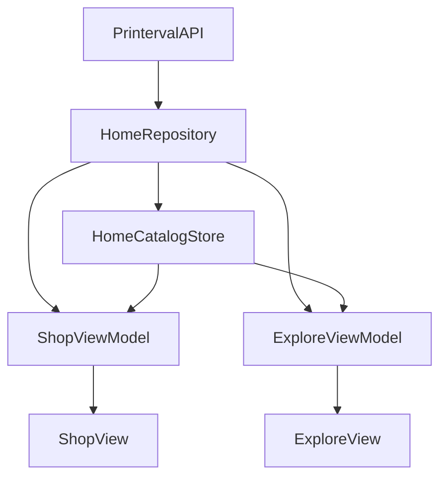

# Shared Catalog — Shop (Home) + Explore

## Bài toán

Hai tab cần **cùng data**:

| Data | API | Home (Shop) | Explore |
|------|-----|-------------|---------|
| Categories | `category/tree` | rail ngang dưới search | lưới 2 cột |
| Events | `event-box` → `result.events` | `EventBoxView` (+ products) | — |
| Active event | `get-active-event` | banner **cuối trang** | banner dưới search |


**Không** fetch `event-box` / `category/tree` hai lần. Một cache, hai ViewModel đọc.

---

## Cấu trúc (MVVM)

```
Shared/Models/
  CategoryTree.swift      # model category (giữ theo team)
  EventBox.swift          # model event dùng chung

Features/Shop/
  Domain/HomeCatalogProviding.swift   # HomeCatalog + protocol
  Data/HomeCatalogStore.swift         # @Published cache (source of truth)
  Data/HomeRepository.swift           # fetch 1 lần / session
  Data/HomeDTOMapper.swift            # decode events + upcoming_events
  Presentation/…                     # Shop UI

Features/Explore/
  Presentation/
    ExploreView.swift
    ExploreViewModel.swift            # inject HomeCatalogProviding
    Components/
      ActiveEventsBanner.swift
      ExploreCategoryGrid.swift
```



---

## Luồng data

1. User vào **Shop** → `ShopViewModel.loadHome()` → `HomeRepository.loadHomeCatalog()`  
   - Ghi `categories`, `eventBox`, `activeEvents` (`get-active-event`), …
2. User sang **Explore** → `ExploreViewModel.load()`  
   - Đọc `catalog.cachedCatalog()`  
   - Nếu đã có categories / activeEvents → **không** gọi API lại  
   - Nếu vào Explore trước Shop (cache trống) → gọi cùng `loadHomeCatalog()` (idempotent nhờ `didLoadHome`)

---

## Decode

### `event-box`
`result.events` → `EventBox` (Home rail + page_data products).

### `get-active-event`
Mapper linh hoạt (`HomeDTOMapper.activeEvents`):

- `result` là **object** → 1 `ActiveEvent`
- `result` là **array** → nhiều banner
- Key ảnh: `banner_url`, `image_url`, …

---

## UI Explore

1. Navigation title **Find Products**
2. Search Store
3. `ActiveEventsBanner` (`get-active-event`)
4. `ExploreCategoryGrid` — 2 cột

---

## Quy tắc khi thêm feature mới dùng chung data

1. **Model dùng ≥ 2 feature** → `Shared/Models`
2. **Fetch / cache** → `HomeRepository` + `HomeCatalogStore` (hoặc rename sau thành `CatalogRepository` nếu muốn trung lập hơn)
3. **ViewModel** chỉ inject `HomeCatalogProviding` — không gọi `PrintervalAPI` trực tiếp
4. **Không** tạo `ExploreRepository` song song gọi lại cùng endpoint

---

## File liên quan

| Việc | File |
|------|------|
| Model event | `Shared/Models/EventBox.swift` |
| Cache | `Features/Shop/Data/HomeCatalogStore.swift` |
| Prefetch | `Features/Shop/Data/HomeRepository.swift` |
| Explore VM | `Features/Explore/Presentation/ExploreViewModel.swift` |
| Explore UI | `Features/Explore/Presentation/ExploreView.swift` |
| Active banner | `Features/Explore/Presentation/Components/ActiveEventsBanner.swift` |
| Active model | `Shared/Models/ActiveEvent.swift` |
