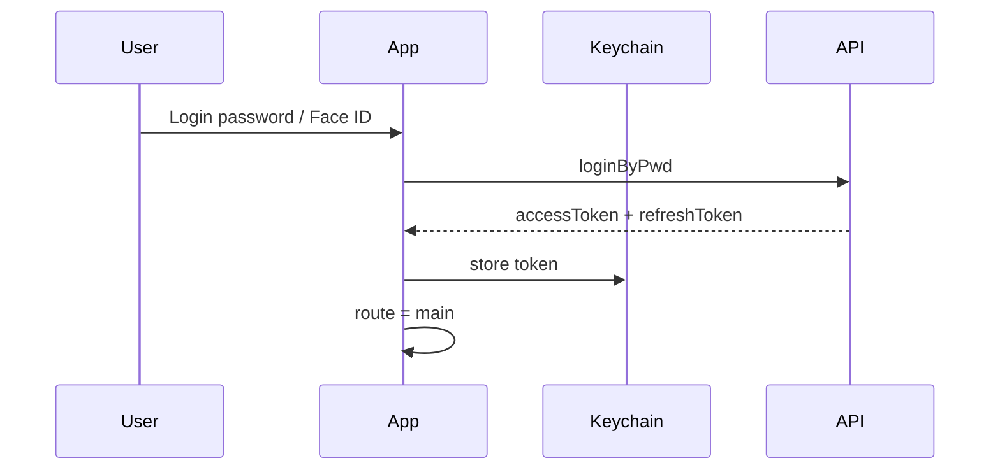
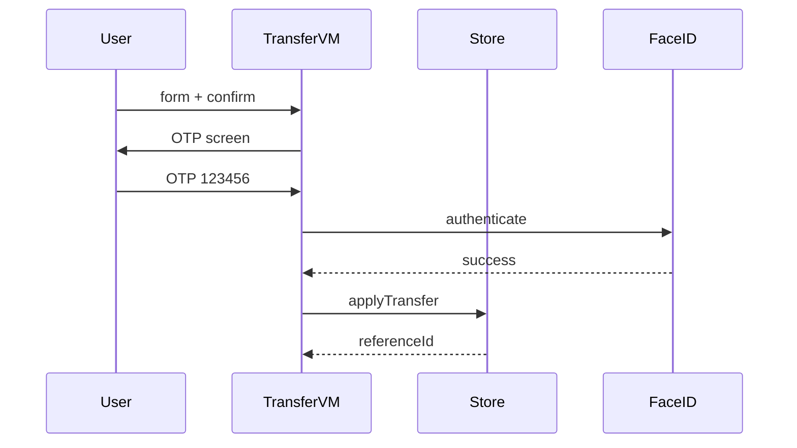

# System Design — Mobile Banking (Nectar)

## 1. Auth & session

**Trade-off:** Keychain an toàn hơn UserDefaults/MMKV cho token; flag UI (onboarding, biometric) có thể ở UserDefaults.

## 2. Transfer với step-up auth

**Banking rules:**
- Không submit thẳng từ form
- Idempotency: `isSubmitting` flag chặn double-tap
- Reference id `FT{timestamp}` cho đối soát

## 3. Offline & sync

| Scenario | Strategy |
|----------|----------|
| Mất mạng khi xem Home | Cache last balance trong `MockBankStore`; hiện banner offline |
| Transfer khi offline | Queue request local (Core Data / file), sync khi online |
| Stale balance | Pull-to-refresh + TTL 60s trên Home |

**Gap hiện tại:** chưa có offline queue — roadmap Tháng 2+.

## 4. JWT refresh (PostPay-style)

- `JWT-001` → refresh token → retry request
- `JWT-002` → force logout, clear Keychain

Implement trong [APIClient.swift](../Nectar/Core/Network/APIClient.swift).

## 5. Fraud signals (concept)

- Velocity: >3 transfers / 5 phút → thêm OTP
- Device binding: `deviceId` gửi kèm refresh
- Amount anomaly: vượt hạn mức ngày → step-up

## 6. Widget sync

`DashboardViewModel` gọi `WidgetDataStore.updateBalance` sau mỗi load → Widget extension đọc App Group.

## Trình bày 20 phút (outline)

1. Problem: mobile banking cần gì? (2 phút)
2. Architecture layers + diagram (5 phút)
3. Transfer + security flow (5 phút)
4. Offline/sync trade-offs (4 phút)
5. Q&A prep: Double vs Decimal, Keychain, MainActor (4 phút)
